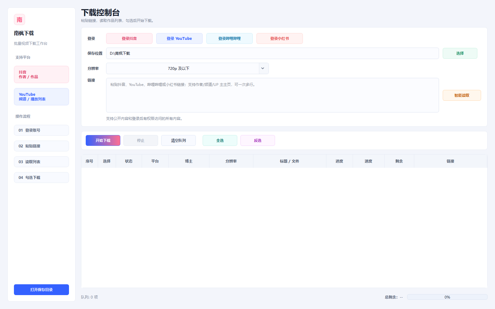

# 南枫下载

面向个人批量工作流的抖音 / YouTube / 哔哩哔哩 / 小红书 Windows 桌面下载工具。当前正式 Windows 版使用 Python、PySide6、yt-dlp、Playwright 和 FFmpeg。

当前技术栈、目录职责、发布状态和接手说明见 [docs/context.md](docs/context.md)；正式开发经验、证据矩阵与回归门槛见 [docs/app-development-experience-audit.md](docs/app-development-experience-audit.md)。

## 界面预览



## 能力边界

- 支持公开内容，以及登录后当前账号本来有权限访问的内容。
- 不支持会员、付费、DRM、私密内容或访问权限绕过。
- 不在软件里填写或保存账号密码。
- 软件内登录使用独立持久浏览器资料目录；Cookie 只交给下载器访问对应平台。
- 外部平台仍可能基于网络、地区、IP 或账号行为要求验证，软件不会把平台限制伪装成本地修复成功。

## 当前功能

- 智能识别抖音、YouTube、哔哩哔哩和小红书的单视频及作者/频道/UP 主链接；B站多 P 选集会展开为可勾选的独立队列项。
- 小红书只把视频笔记加入队列，图文笔记不会伪装成视频；作者页被平台遮蔽时会明确提示软件内登录。
- 单视频只加入一条；集合链接读取可勾选作品列表。
- 支持最佳画质、1080p、720p、360p 和仅音频 MP3。
- 支持每行单独修改分辨率、全选、反选和执行前重新检查勾选。
- 按平台和作者建立目录，文件名优先使用发布时间加标题。
- 快速跳过本地已有有效媒体。
- 显示进度、速度、剩余时间、等待联网、失败、停止、跳过和完成状态。
- 网络恢复后自动继续；停止信号会中断 yt-dlp 进度回调、抖音分块读取和 FFmpeg 子进程。
- 最终输出通过 ffprobe 或媒体文件头验证，网页、JSON、空文件和伪 mp4 不会标记为成功。

## 启动

安装依赖：

```powershell
python -m pip install -r requirements.txt
```

开发启动：

```powershell
python start.py
```

也可以双击 `启动南枫下载.bat`。

## 自动验证

```powershell
python -m unittest discover -s tests -v
python -m compileall -q app tests scripts
```

真实平台回归与持续平均速度报告：

```powershell
python scripts/run_real_download_regression.py `
  --youtube-single "https://www.youtube.com/watch?v=PONo81nwVy4" `
  --douyin-single "<当前可访问的抖音单视频链接>" `
  --douyin-author "<当前可访问的抖音作者链接>" `
  --bilibili-single "<当前可访问的 B站单视频链接>" `
  --bilibili-space "<当前可访问的 B站 UP 主空间链接>" `
  --xiaohongshu-single "<当前可访问的小红书视频笔记链接>" `
  --xiaohongshu-author "<当前可访问的小红书作者主页链接>" `
  --require-douyin
```

真实回归会下载单视频样本、验证媒体、记录目录读取耗时和持续平均速度；作者/频道链接只验证目录语义，避免误触发整批下载。输出保存在 `.verification-downloads/`，报告写入 `docs/verification/real-download-latest.json`，两者默认不进入 Git。

## Windows 独立源码

当前历史仓库混有 Android 和 macOS 资料。Windows 发布与后续维护使用清单式独立导出：

```powershell
python scripts/export_windows_source.py `
  --target D:\CodexProjects\NanfengDownloader-Windows `
  --init-git
```

导出器只复制 Windows 源码、测试、验证脚本和文档，拒绝 `.command`、`*_mac.spec` 与 Android 文件；不会删除源目录或目标目录中的额外文件。

## Windows 打包

先通过源码或 `.bat` 验证，再按需执行：

```powershell
python -m PyInstaller --noconfirm 南枫下载_Windows.spec
```

发布到 GitHub 时优先使用 Inno Setup 安装包：

```powershell
powershell -ExecutionPolicy Bypass -File scripts\build_windows_installer.ps1
```

构建脚本默认使用 Inno Setup 7 x64；仅在 7 未安装时回退到 Inno Setup 6。

安装程序输出到 `installer\NanfengDownloader-Windows-v2026.07.26-Setup.exe`。安装范围为当前 Windows 用户，卸载不会删除下载目录或软件专用登录资料。

打包前应确认 FFmpeg、Node.js 和 YouTube PO Provider 被正确发现；最终还需验证 EXE 启动、产品名、品牌图标、依赖、安装包和 SHA-256。
